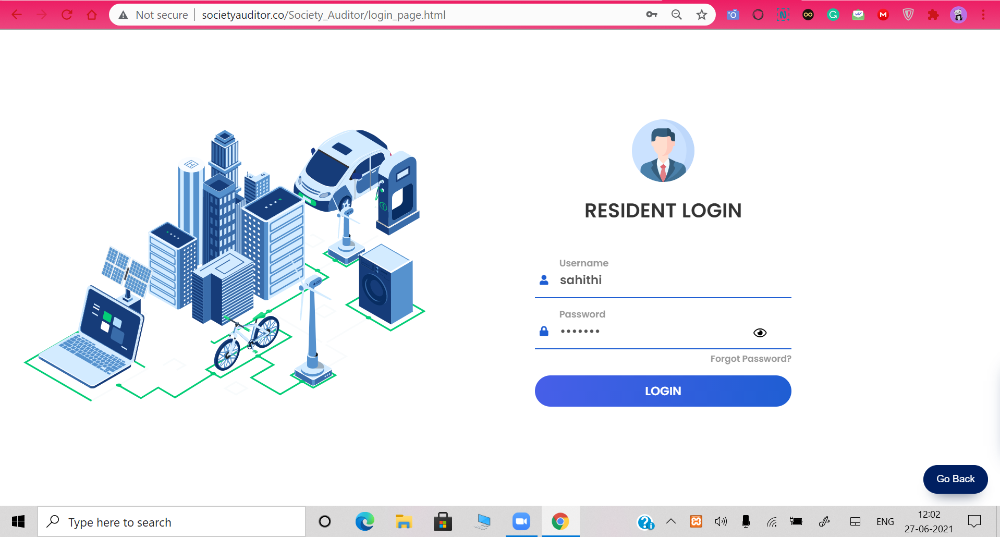

# Society Auditor

### A Residential Management System

<b>The main objective of our website is to facilitate the staff-residents
interactions, maintenance of the resident blocks, and enforcement of
security in the residentiary effortlessly.</b>

# Project Demo

# Instructions to run application:

      1. Go Ahead and browse the webpage. 
      
      2. Selct sign up or register. 

      3. After you are succesfully logged in then a dashboard will appear.

      4. Using this dfashboard you can access all the services. 
 
      5. Clone this repository on your desired directory.
      
      6. Head up to Android Studio and then Open an Exiting Project.
      

# Key-Features

    1. Alluring User Interface - We keep things simple, straight, and attractive.

    2. Personalized Experience - You can feel accustomed to the website just like you felt with your neighborhood. We credit our personalized website features for that secure experience of yours.

    3. Contactless Devleries - Schedule Sanitized and Contactless Deliveries.

    4. Guests Arrivals - Schedule Guest Arrivals along with Covid Measures

    5. Easy Bill Payments - Give up all your struggles in catching up to your owner's schedule to pay rent. Society Auditor has got easy bill payments through complete payments or installments.

    6. Confidential Conversations - From irritating neighbors to ill-maintained utilities, speak candidly about your problems with the authorities in confidentiality

    7. Announcements and Notices

    8. Virtual Meetups using Agora.
 
 # Motivation for the project:

  Earlier, people living in apartments or some sort of society used to discuss
  and solve the problems through face-to-face interactions. Thanks to the
  busy schedules people have developed for themselves and contagious
  environments created by pandemics like corona in recent years, it is
  getting very difficult for residents to have the same old meets.
  Developing a residential management website seemed to be more
  relevant than ever to us. So here we focused on developing a
  sophisticated website under this project, which deals with all the
  problems like resident’s queries, complaints, all amenities-related
  problems, delivery orders, and many more which without an online
  The platform would have become a barrier besides being a resident’s rights.

# Challenges We Ran Into

First of all, it was quite a tedious task to add so many features in just two days. We guys worked a lot on the user interface and tried to make things simple for users. I can list out our shared challenges as follows:

    1. Database management - We spend a lot of time building a proper database to hold all the data. 
    2. Designing webpages - We used a lot of frameworks and libraries to make good user experiences.
    3. Syncing the flow -  We spend a lot of time thinking about the flow and achieving it.
    4. Hosting the files - We faced some issues while taking our database to the server and hosting on AWS.
    5. Designing the dashboard - This was the crucial part of the project, and we nearly spent much time designing a simple but exciting dashboard.

There were other challenges like team management and communication. Hopefully, we solved each of the challenges. 

# Difference from the existing solutions

The existing solutions are not abided with the pandemic situation. So, we are here with some exciting and innovative features like, 

    Scheduling Guest Arrivals with pandemic related norms,
    Scheduling contactless deliveries of parcels,
    Notice Board,
    Lodging Complaints, 
    Handling Security Staffs,
    Looking after security cameras,
    Booking your Amenities safely and securely,
    Pay your society maintenance at your ease,
    Scheduling virtual meets with society members on Agora. 

So having the above features in one place is very rare, and that.’s what makes our application different from others. 

# Tech stack and Modules used:

        Frontend : HTML, CSS, JavaScript, JQuerry, Bootstrap, Bulma, FontAwesome, Google Fonts, Box Icvons, GlightBox, Swiper JS.
        
        Libraries : AOS Library, LottieFiles
        
        Middleware : PHP
        
        Backend :  Xampp, Apache Server, MYSQL
        
        Cloud: Amazon Web Services(AWS), EC2, RDS, VPC
        
        SDK Involved : Agora SDK and Agora API
        
        Domain Purchased From : GoDaddy
        
# ScreenShots

### Home page
   

### Login and Register Page
  

### Services
  

### User Dashboard and features
 

### Meeting Features(Agora)
 

### Admin Dashboard and Features
 

### About us
 

# Links:
* [Check out Website](http://www.societyauditor.co/Society_Auditor/)

* [View Video](https://youtu.be/DxtWTey759s)

* [View Presentation](https://docs.google.com/presentation/d/1SWwoQHbme-iSap-2QyY1aBw2SxEmgI0mfYvKuS0kEHY/edit#slide=id.p3)

* [Backend Files](https://github.com/moit-bytes/SocietyAuditor/tree/main/backend)

## Contributors ✨

Reach out to us, if you liked this :)
<table>
  <tr>
    <td align="center"><a href="https://github.com/moit-bytes"> <b>Mohit Kumar</b></a> </td>
    <td align="center"><a href="https://github.com/sahithipriya7419"> <b>Sahithi Priya</b></a> </td>
    <td align="center"><a href="https://github.com/niteshbharti005101"> <b>Nites Bharti</b></a> </td>
</table>
